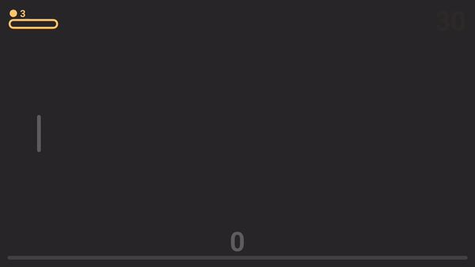
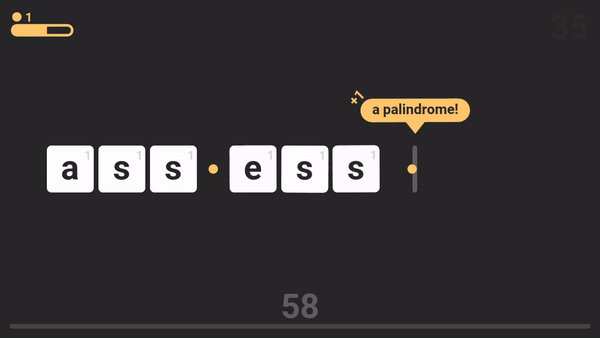

# re🟡cycle
## About

re🟡cycle is a fast-paced word-puzzle-ish game where you try to achieve a high score by typing leters, forming (only!) words, fulfilling quests, leveling up and strategically using a limited number of spaces.

This game was built for the [Ludum Dare](https://ldjam.com) 54 compo in less than 48h. Rate it [here](https://ldjam.com/events/ludum-dare/54/recycle)! (Or just run it using [LÖVE](https://love2d.org/), or download the Windows/Mac binaries on [itch.io](https://ovidios.itch.io/re-cycle))

## Resources Used

- [LÖVE](https://love2d.org/) as the game framework
- [Chiptone](https://sfbgames.itch.io/chiptone) for sound generation
- The [classic.lua](https://github.com/rxi/classic), [json.lua](https://github.com/rxi/json.lua), and [lovebird](https://github.com/rxi/lovebird) libraries
- [makelove](https://github.com/pfirsich/makelove) to simplify the build process
- A number of word datasets or publicly available lists (found in `res/lists/`):
  - [animals.lua](https://gist.github.com/EyeOfMidas/311e77b8b8c2f334fc8bdaf652c1f47f)
  - [colors.lua](https://github.com/codebrainz/color-names)
  - [elements.lua](https://gist.github.com/GoodmanSciences/c2dd862cd38f21b0ad36b8f96b4bf1ee)
  - [emojis.lua](https://github.com/datasets/emojis)
  - [gems.lua](https://en.wikipedia.org/wiki/List_of_gemstones_by_species)
  - [ld_themes.lua](https://en.wikipedia.org/wiki/Ludum_Dare)
  - [mtg.lua](https://scryfall.com)
  - [mtg_keywords.lua](https://media.wizards.com/2023/downloads/MagicCompRulesWOE%2020230901.pdf)
  - [pokemon.lua](https://github.com/lgreski/pokemonData)
  - [tng.lua](https://en.wikipedia.org/wiki/List_of_Star_Trek:_The_Next_Generation_episodes)
  - [zodiac.lua](https://en.wikipedia.org/wiki/Astrological_sign)
